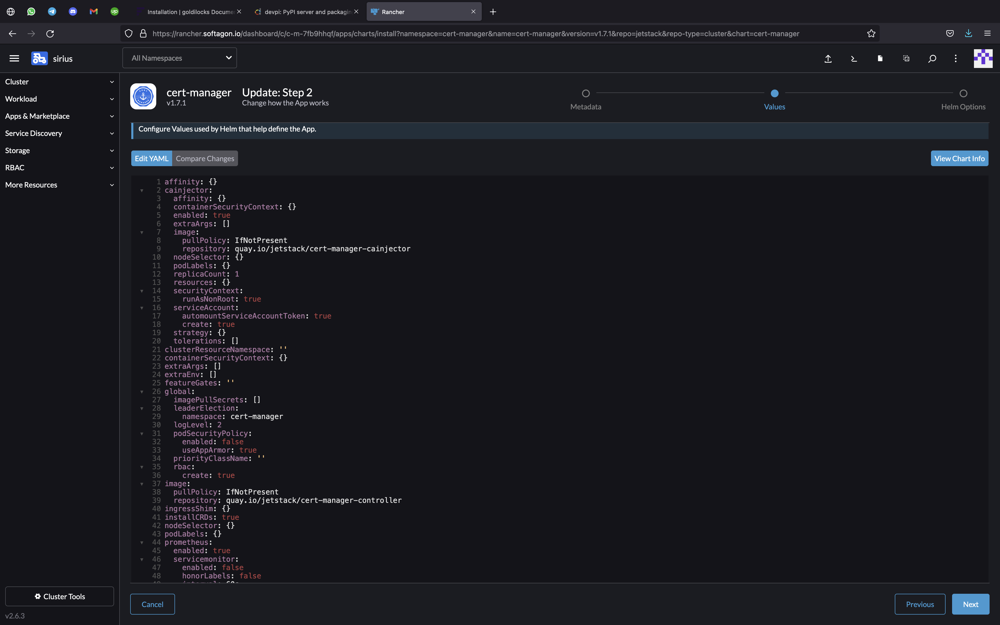

# These configurations sre already done. This actions will only be required in new cluster with similar setup. 

## forcertmanager
This directory contains files related to cert-manager.
- values.yaml is the values files used during cert-manager deployment from Rancher UI

- http01-cluster-issuer.yaml is HTTP01 Cluster Issuer

After deploying cert-manager apply the http01-cluster-issuer.yaml as `kubectl apply -f http01-cluster-issuer.yaml`

## traefik
- values.yaml values files used to deploy traefik from Rancher UI. 
- traefikdashboard.yaml contails certificate ingressroute  middleware authsecret for traefik dashboard

For other info refer file for comments

## refer test.yaml for Ingress route example